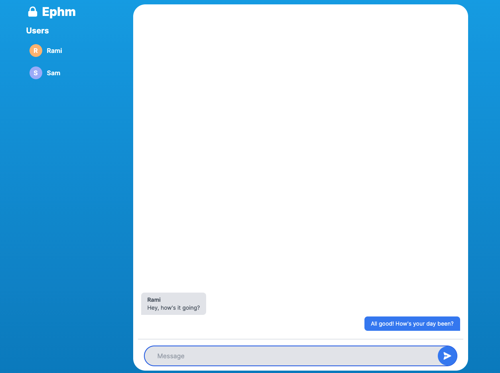
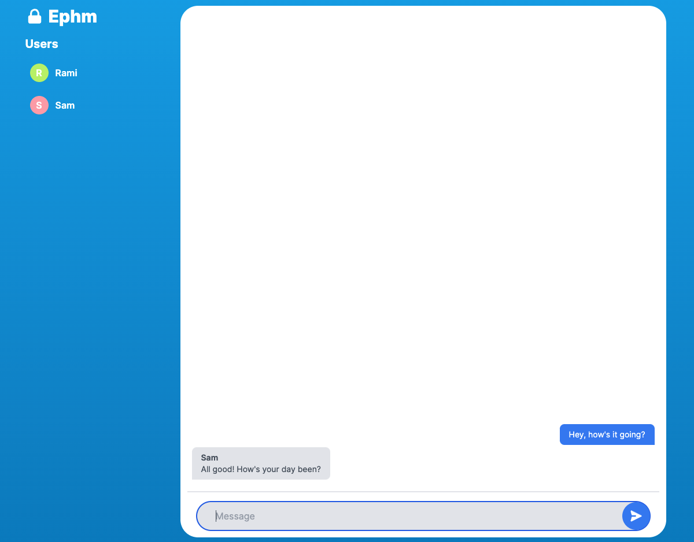

# Go Socket Chat

Small socket-based chat app written in Go, HTML, JS, and TailwindCSS.

# Usage
You can use this to chat with friends online. The chat is ephemeral, only visible on your local browsers until you close the tab. Nothing is stored anywhere.
https://ephm.herokuapp.com/

<div style="display: flex; flex: row;">


</div>

# Local development
To run locally:

Frontend precompilation:
```
cd static/
npm i
npx tailwind -i ./css/main.css -o ./css/out.css --watch
```

Run app from main directory:
```
go run cmd/web/*.go
```
